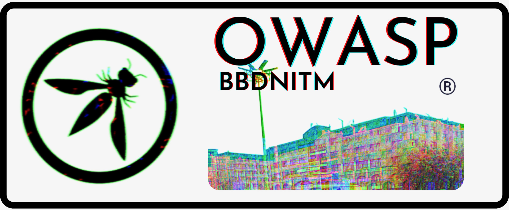

---

layout: col-sidebar
title: OWASP Babu Banarasi Das NITM
tags: Student Chapter
level: 0
region: Asia
meetup-group: owasp-babu-banarasi-das-nittm
country: India
postal-code: 226028

---

## Welcome

Welcome to the OWASP Babu Banarasi Das National Institute of Technology Student Chapter. We host AppSec Events, Chapter Meetings, and CTFs to disseminate information and increase awareness in Information Security. We intent to build a community where one can learn and discuss contemporary issues related to cybersecurity.

## Participation
The Open Web Application Security Project (OWASP) is a nonprofit foundation that works to improve the security of software. All of our projects ,tools, documents, forums, and chapters are free and open to anyone interested in improving application security.
Chapters are led by local leaders in accordance with the [Chapter Leader Handbook](/www-policy/rules-of-procedure/chapter-handbook). 
There are 2 ways to participate in the OWASP BBDNITM Chapter Events
* Attending the Event
* Speaking at the Event 

<h3>Become a Speaker</h3>
Call For Speakers is open - if you would like to present a talk on Application Security at future OWASP BBDNITM Chapter events - please review and agree with the [OWASP Speaker Agreement](https://owasp.org/www-policy/legal/speaker-agreement). Visit the [Speakers](speakers.md) tab for more details and send the proposed talk details.

## Next Meeting/Event
---------------------

