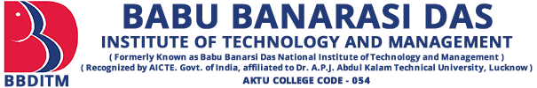
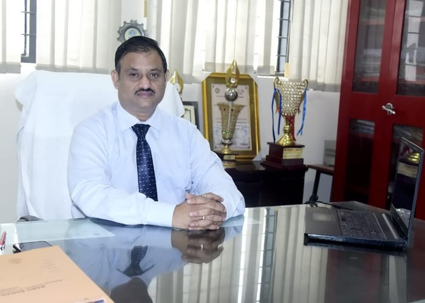

---

title: About
displaytext: About Us
layout: null
tab: true
order: 1
tags: Student Chapter

---

## About OWASP

The Open Web Application Security Project (OWASP) is a nonprofit foundation that works to improve the security of software. All of our projects, tools, documents, forums, and chapters are free and open to anyone interested in improving application security.

## About BBDITM
 

 
 

Babu Banarasi Das National Institute of Technology & Management, Lucknow (BBDNITM) is one of the efforts to cherish the memory of the great & noble soul Babu Banarasi Das Ji, Ex. Chief Minister, Govt. of Uttar Pradesh.
With a privilege of having inherited his legacy, BBDNITM pioneered and today offers the richest programs in Engineering and Management. Since it’s establishment in 1998, we have been striving for setting high standards for oue stake holders, and committed to meeting our social responsibilities. We are incorporating world’s best academic practices into all our academic programs.

 

Dr. Shailendra Singh Chauhan 
Director 
BBDITM, Lucknow 

 
 
 
 

## Leaders
* [Aman Srivastava](https://www.linkedin.com/in/a-manonearth/)
* [Shivam Dixit]()
* [Ankita Agarwal](https://www.linkedin.com/in/ankita-agarwal-0a2a561a5)

## Core Team
* [Rishabh Shukla](https://www.linkedin.com/in/0xrishabh/) (Core Team Member)
* [Pranjali Shah](https://www.linkedin.com/in/pranjali-shah-7409351bb/) (Academic Coordinator)
